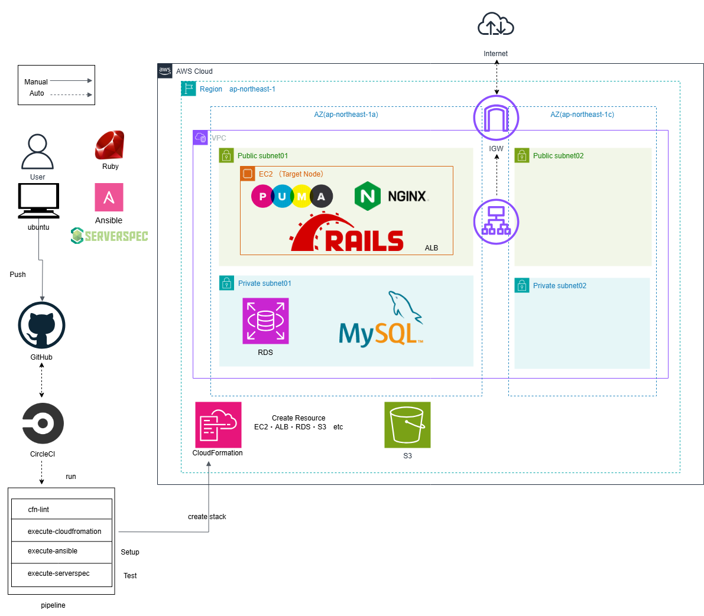

# circleci-dynamic-ip
Ansibleのdynamic-inventoryを用いてパブリックIPアドレスを動的に取得し、IPアドレスの変更にも対応できるように設定しました。

## 概要
このリポジトリでは以下の自動化プロセスをCircleCIで実行します：
1. **CloudFormationの構文チェック**  
   <video src="https://github.com/user-attachments/assets/9fd21bfa-0783-448f-998f-096877d106d0" controls autoplay>
</video>
2. **CloudFormationスタック実行**  
   - VPC、EC2、ALB、RDS、S3の作成を含むAWSインフラの構築  
   <video src="https://github.com/user-attachments/assets/874156d4-d53b-4ae4-a84a-4ce1e7522a36" controls autoplay>
</video>
3. **Ansibleによる環境構築**  
   - EC2インスタンス上でサンプルアプリケーションのセットアップ  
   <video src="https://github.com/user-attachments/assets/9e4d2a9f-22b0-4b14-b043-66a1f58d0f35" controls autoplay>
</video>
4. **Serverspecでのテスト**  
   - EC2インスタンスの環境確認および動作テスト  
   <video src="https://github.com/user-attachments/assets/ca3f1afc-5da5-4a6f-b791-4289ce3a98f9" controls autoplay>
</video>

CircleCI実行結果はこちら：  
[CircleCI Execution Result](https://app.circleci.com/pipelines/github/taemimizukura/circleci-dynamic-ip/70/workflows/80438b08-69fb-4c66-ab19-c149d055a44b)  

証跡画像はこちら：  
[evidence-image.md](evidence-image.md)
## 実行環境
Control Node：ubuntu(WSL)  
Target Node：EC2(Amazon Linux2)  

### インストールしたツール（Control Node: Ubuntu on WSL）
- Ansible 2.16.3
- AWS CLI 2.19.4
- Ruby 3.2.3
- Bundler 2.5.23
- Serverspec 2.42.3
- CircleCI CLI

Elastic IPでの固定化はこちら：  
[circleci_lecture13](https://github.com/taemimizukura/circleci_lecture13)

