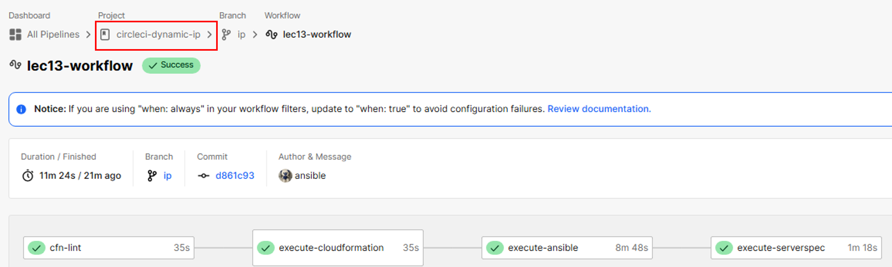
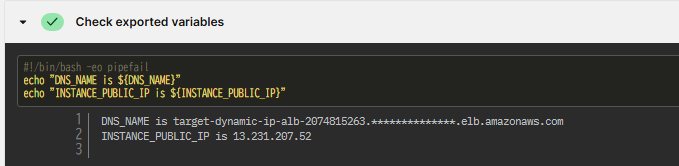
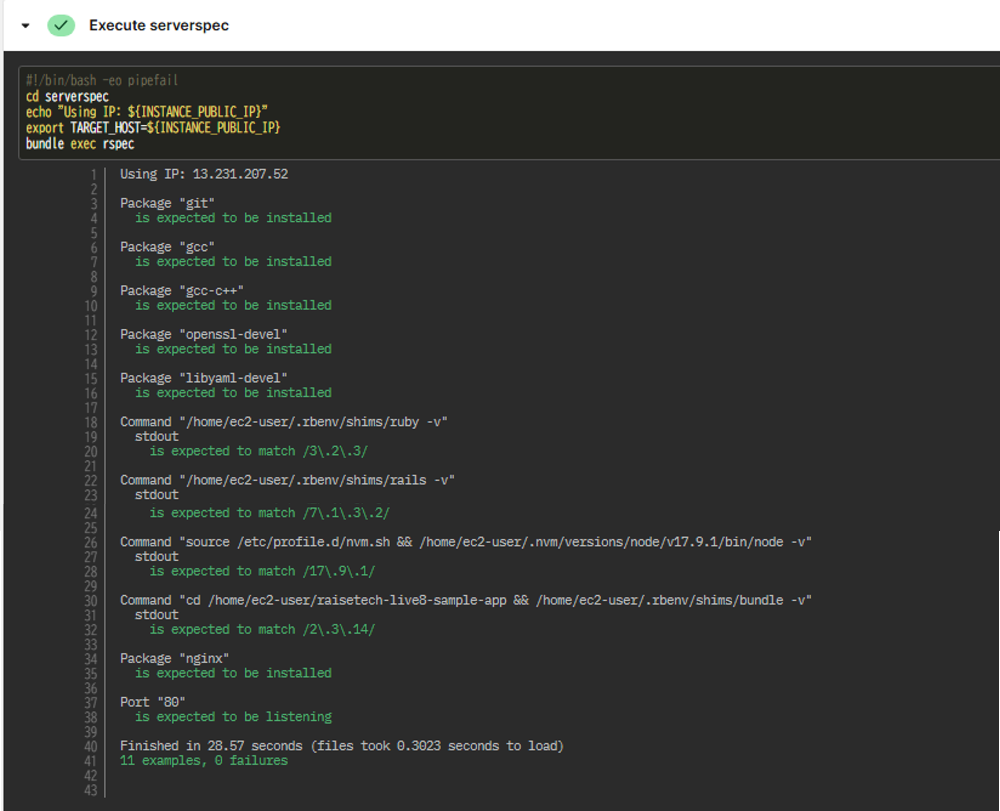
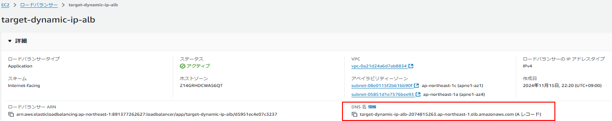
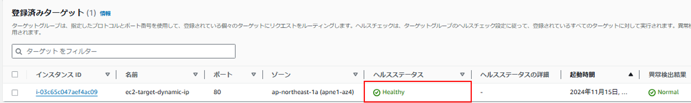
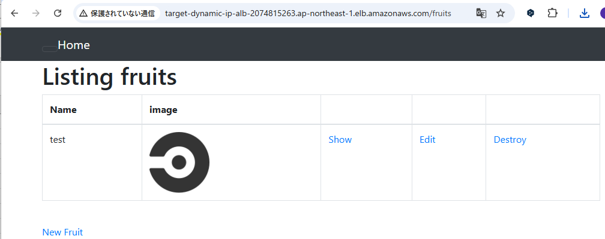
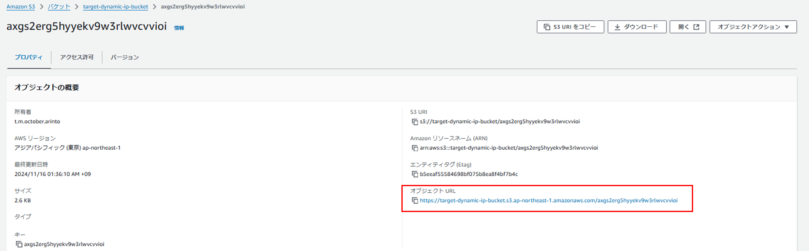
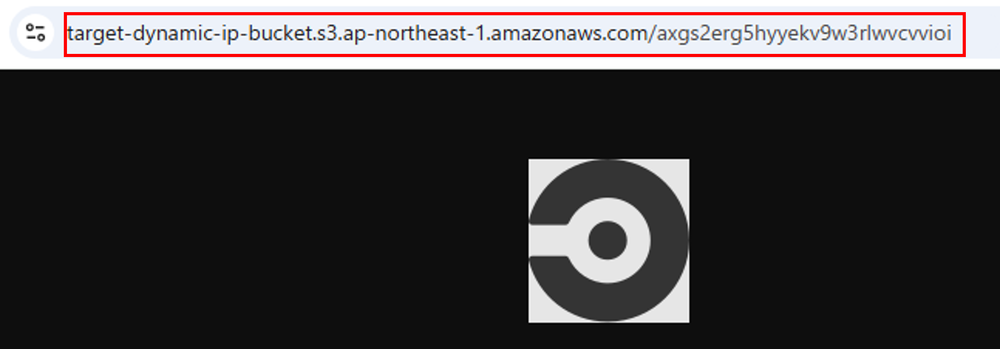

# CircleCI実行結果

## DNS名とPublic IPが動的に取得できていることを確認

# Serverspecテスト結果

# ALB DNS名確認

# ヘルスステータス確認

# サンプルアプリに画像をアップロード
ALB経由でHTTPリクエストをアプリケーションサーバーに転送し、簡単なCRUD処理が可能なアプリケーションを表示しています。

# S3 Bucketに画像が保存されていることを確認

